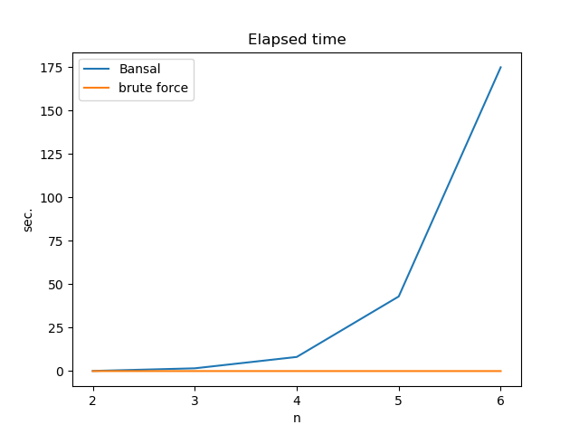
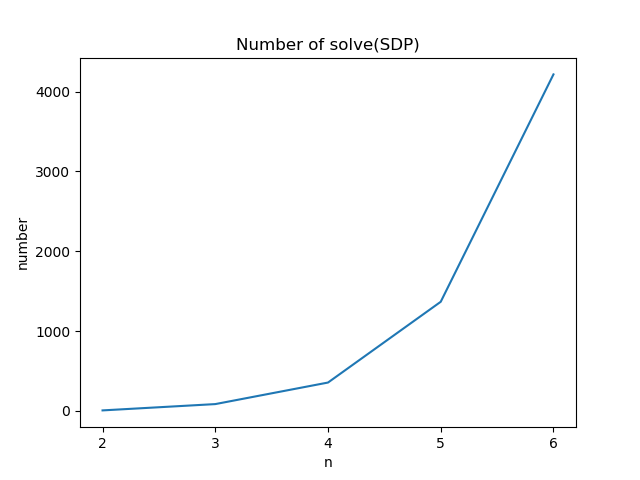

# On hypergraph discrepancy
## Application of Bansal's framework to Roth's problem

Let ROTH(n) be the set of all arithmetic progressions in \[n\]. Applying [Bansal-Dadusch-Garg algorithm](https://arxiv.org/abs/1605.02882) for Beck-Fiala problem to ROTH(n) brings a coloring with discrepancy _O(t log n)_, which is theoretically not better than random coloring. How good is it practically, however?

### Efficiency



### Accuracy
Compares Bansal's algorithm to random coloring for ROTH(4):
```
$ python bdg_on_roth_problem3.py 4 100
...
[Test for ROTH(4)]
sample = 100
discrepancies by Bansal = [2, 2, 2, 2, 2, 3, 2, 2, 4, 4, 2, 2, 3, 2, 3, 2, 2, 3, 2, 3, 2, 2, 2, 3, 2, 4, 2, 2, 3, 3, 3, 2, 4, 2, 3, 2, 4, 2, 2, 4, 4, 2, 2, 2, 2, 3, 2, 3, 2, 2, 3, 3, 4, 2, 2, 2, 3, 2, 3, 4, 2, 2, 2, 2, 2, 2, 2, 3, 2, 3, 2, 2, 2, 2, 2, 2, 4, 2, 2, 2, 2, 2, 3, 2, 2, 2, 2, 2, 2, 2, 2, 2, 2, 2, 3, 2, 4, 3, 3, 2]
mean disc. by Bansal = 2.44
mean disc. by random coloring = 2.5
H0 (null hypothesis): mean disc. by Bansal >= mean disc. by random coloring
t stat. = -0.8785611189861349
ppf of t-distribution with p<0.01, 1-tail, df=99: -2.364605861435974
H0 is not rejected.
```
